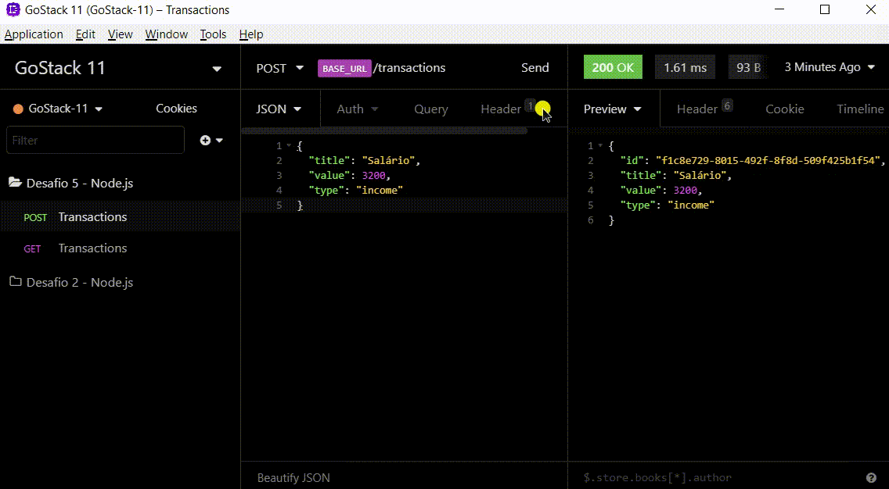
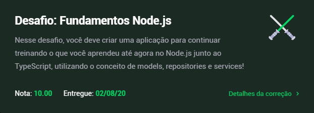
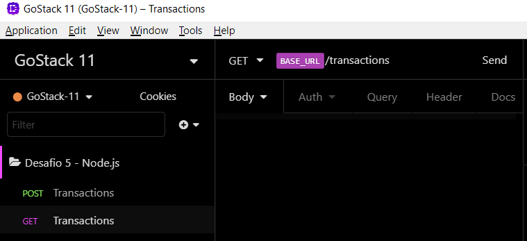

<h1 align="center">
  GoStack 11 - Rocketseat
</h1>

<h3 align="center">
  Desafio 05: Primeiro projeto - Fundamentos do Node.js
</h3>

<blockquote align="center">“Quem nunca errou nunca experimentou nada novo. - Albert Einstein”!</blockquote>

<p align="center">

  

  <a href="https://www.linkedin.com/in/cleytonalves">
    
  </a>


  

  <a href="https://github.com/cleyton1986/rocketseat-gostack-desafio05-fundamentos-nodejs/stargazers">
    
  </a>
</p>

<p align="center">
  <a href="#tecnologias-e-recursos">Tecnologias e Recursos</a>&nbsp;&nbsp;&nbsp;|&nbsp;&nbsp;&nbsp;
  <a href="#sobre-o-desafio">Sobre o desafio</a>&nbsp;&nbsp;&nbsp;|&nbsp;&nbsp;&nbsp;
    <a href="#rotas-da-aplicação">Rotas da aplicação</a>&nbsp;&nbsp;&nbsp;|&nbsp;&nbsp;&nbsp;
  <a href="#específicação-dos-testes">Especificação de testes</a>&nbsp;&nbsp;&nbsp;|&nbsp;&nbsp;&nbsp;
  <a href="#instalação-e-execução">Instalação e execução</a>&nbsp;&nbsp;&nbsp;|&nbsp;&nbsp;&nbsp;
  <a href="#arquivo-do-insomnia">Arquivo do Insomnia</a>&nbsp;&nbsp;&nbsp;|&nbsp;&nbsp;&nbsp;
  <a href="#calendar-entrega">Entrega</a>&nbsp;&nbsp;&nbsp;|&nbsp;&nbsp;&nbsp;
  <a href="#memo-licença">Licença</a>
</p>

## Tecnologias e recursos

- [Node.js](https://nodejs.org/)
- [TypeScript](https://www.typescriptlang.org/)
- [Nodemon](https://github.com/remy/nodemon)
- [Express](https://expressjs.com/)
- [JEST](https://github.com/facebook/jest)
- [Insomnia](https://insomnia.rest/)
- [uuidv4](https://github.com/thenativeweb/uuidv4/)
- [SuperTest](https://github.com/visionmedia/supertest)
- [CORS](https://github.com/expressjs/cors)
- [ts-node-dev](https://github.com/whitecolor/ts-node-dev#readme)

## Sobre o desafio

Aplicação com Node.js e TypeScript, utilizando o conceito de models, repositories e services!

Essa será uma aplicação para armazenar transações financeiras de entrada e saída, que deve permitir o cadastro e a listagem dessas transações.

<p align="center">
  
</p>

### Rotas da aplicação

- **`POST /transactions`**: A rota deve receber `title`, `value` e `type` dentro do corpo da requisição, sendo `type` o tipo da transação, que deve ser `income` para entradas (depósitos) e `outcome` para saídas (retiradas). Ao cadastrar uma nova transação, ela deve ser armazenada dentro de um objeto com o seguinte formato :

```json
{
  "id": "uuid",
  "title": "Salário",
  "value": 3000,
  "type": "income"
}
```

- **`GET /transactions`**: Essa rota deve retornar uma listagem com todas as transações que você cadastrou até agora, junto com o valor de soma de entradas, retiradas e total de crédito. Essa rota deve retornar um objeto com o formato a seguir:

```json
{
  "transactions": [
    {
      "id": "uuid",
      "title": "Salário",
      "value": 4000,
      "type": "income"
    },
    {
      "id": "uuid",
      "title": "Freela",
      "value": 2000,
      "type": "income"
    },
    {
      "id": "uuid",
      "title": "Pagamento da fatura",
      "value": 4000,
      "type": "outcome"
    },
    {
      "id": "uuid",
      "title": "Cadeira Gamer",
      "value": 1200,
      "type": "outcome"
    }
  ],
  "balance": {
    "income": 6000,
    "outcome": 5200,
    "total": 800
  }
}
```

**Dica**: Dentro de balance, o income é a soma de todos os valores das transações com `type` income. O outcome é a soma de todos os valores das transações com `type` outcome, e o total é o valor de `income - outcome`.

**Dica 2**: Para fazer a soma dos valores, você pode usar a função [reduce](https://developer.mozilla.org/pt-BR/docs/Web/JavaScript/Reference/Global_Objects/Array/reduce) para agrupar as transações pela propriedade `type`, assim você irá conseguir somar todos os valores com facilidade e obter o retorno do `balance`.


### Específicação dos testes

Para esse desafio temos os seguintes testes:

- **`should be able to create a new transaction`**: Para que esse teste passe, sua aplicação deve permitir que uma transação seja criada, e retorne um json com a transação criada.

- **`should be able to list the transactions`**: Para que esse teste passe, sua aplicação deve permitir que seja retornado um objeto contendo todas as transações junto ao balanço de income, outcome e total das transações que foram criadas até o momento.

- **`should not be able to create outcome transaction without a valid balance`**: Para que esse teste passe, sua aplicação não deve permitir que uma transação do tipo `outcome` extrapole o valor total que o usuário tem em caixa, retornando uma resposta com código HTTP 400 e uma mensagem de erro no seguinte formato: `{ error: string }`


## :calendar: Entrega

Esse desafio foi entregue na plataforma Skylab - Rocketseat.

<p align="center">
  
</p>

## Instalação e execução

```bash
# Clone esse repositório
$ git clone https://github.com/cleyton1986/rocketseat-gostack-desafio05-fundamentos-nodejs

# Entre no diretório
$ cd rocketseat-gostack-desafio05-fundamentos-nodejs

# Instale as dependências
$ yarn

# Rode a aplicação
$ yarn dev:server

# Rode os testes
$ yarn test
```

## Arquivo do Insomnia
Caso queira executar os testes através do Insomnia, importe o arquivo .json que está na pasta de "resources", rode o servidor com o comando **yarn dev** no seu terminal e teste as rotas.

<p align="center">
  
</p>

## :memo: Licença

Esse projeto está sob a licença MIT. Veja o arquivo [LICENSE](LICENSE) para mais detalhes.

---

Developed by 🖖🏽 Cleyton Alves 👨🏽‍💻 Inspired by RocketSeat 🚀
